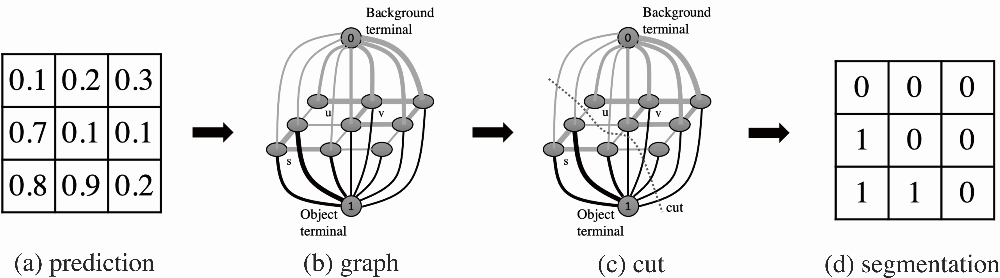

# Graph Cuts Loss to Boost Model Accuracy and Generalizability for Medical Image Segmentation
Pytorch implementation for our ICCVW paper '[Graph Cuts Loss to Boost Model Accuracy and Generalizability for Medical Image Segmentation](https://openaccess.thecvf.com/content/ICCV2021W/CVAMD/papers/Zheng_Graph_Cuts_Loss_To_Boost_Model_Accuracy_and_Generalizability_for_ICCVW_2021_paper.pdf)'.

  

## Acknowledgement
**Implementations of the losses cited in our work are public avaliable.** \
clDice - a Novel Topology-Preserving Loss Function for Tubular Structure Segmentation [(clDice)](https://github.com/jocpae/clDice) \
An Elastic Interaction-Based Loss Function for Medical Image Segmentation [(EIB)](https://github.com/charrywhite/elastic_interaction_based_loss) \
Learning Active Contour Models for Medical Image Segmentation [(AC)](https://github.com/xuuuuuuchen/Active-Contour-Loss)\
Learning Euler's Elastica Model for Medical Image Segmentation [(ACE)](https://github.com/HiLab-git/ACELoss) \
Reducing the Hausdorff Distance in Medical Image Segmentation with Convolutional Neural Networks [(HD)](https://github.com/JunMa11/SegWithDistMap/blob/5a67153bc730eb82de396ef63f57594f558e23cd/code/train_LA_HD.py#L106) \
Boundary loss for highly unbalanced segmentation [(BD)](https://github.com/LIVIAETS/boundary-loss)

## Note
Contact: Zhou Zheng (zzheng@mori.m.is.nagoya-u.ac.jp)